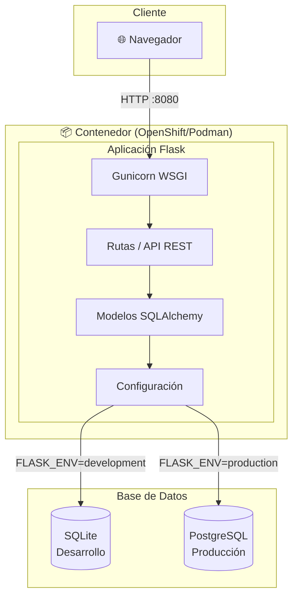
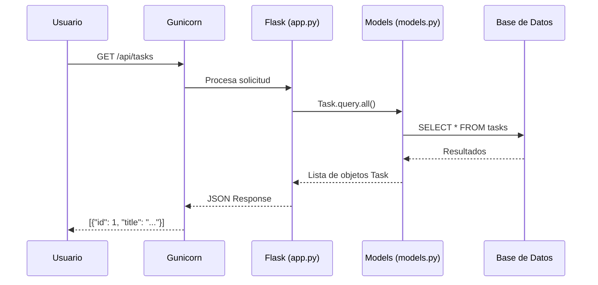
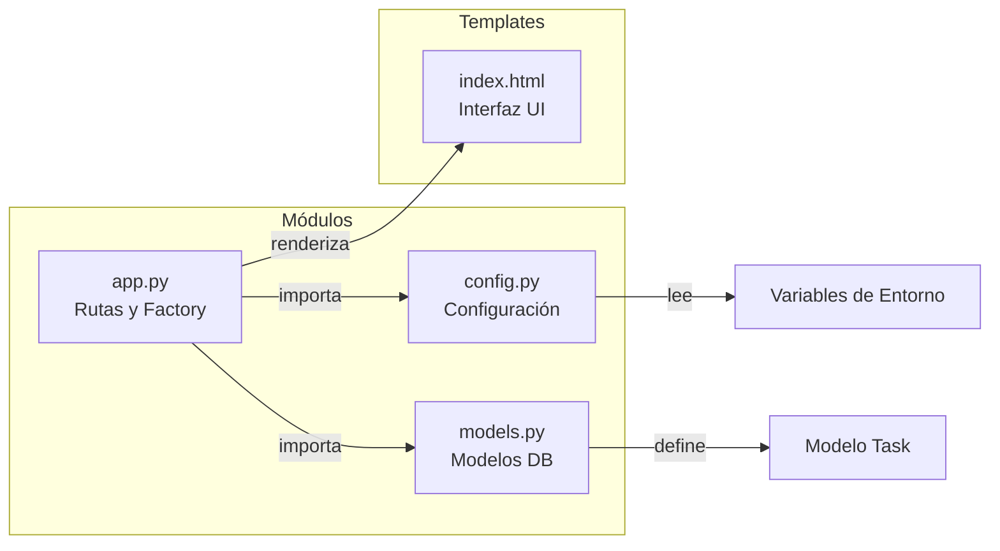

# Lista de Tareas - Flask App

Aplicación web para gestionar una lista de tareas, construida con Flask y SQLAlchemy.

## Características

- Crear, leer, actualizar y eliminar tareas (CRUD)
- Marcar tareas como completadas
- API REST para integración
- Interfaz de usuario moderna y responsive
- Soporte para SQLite (Desarrollo) y PostgreSQL (Producción)

## Arquitectura

### Diagrama de Componentes



### Diagrama de Flujo de Solicitud



### Estructura de Módulos



## Requisitos

- Python 3.12+
- pip

## Instalación

1. Clonar el repositorio:
```bash
git clone <url-del-repositorio>
cd simple-todo
```

2. Crear un entorno virtual:
```bash
python -m venv venv
source venv/bin/activate  # En Windows: venv\Scripts\activate
```

3. Instalar dependencias:
```bash
pip install -r requirements.txt
```

4. Configurar variables de entorno:
```bash
cp .env.example .env
# Editar .env con tu configuración
```

## Configuración

### Variables de Entorno

| Variable | Descripción | Valor por defecto |
|----------|-------------|-------------------|
| `FLASK_ENV` | Ambiente de ejecución (`development`, `production`, `testing`) | `development` |
| `SECRET_KEY` | Clave secreta para sesiones | `dev-secret-key...` |
| `PORT` | Puerto en que escucha la aplicación | `8080` |
| `DB_USER` | Usuario de la base de datos | - |
| `DB_PASSWORD` | Contraseña de la base de datos | - |
| `DB_HOST` | Host de la base de datos | `localhost` |
| `DB_PORT` | Puerto de la base de datos | `5432` |
| `DB_NAME` | Nombre de la base de datos | - |

### Base de Datos

**Desarrollo (SQLite):**
```bash
# No requiere configuración adicional
# Si no se configuran las variables DB_*, se usa SQLite automáticamente
# Se crea el archivo todo.db
```

**Producción (PostgreSQL):**
```bash
export FLASK_ENV=production
export DB_USER=admin
export DB_PASSWORD=tu_contraseña_segura
export DB_HOST=localhost
export DB_PORT=5432
export DB_NAME=todo_db
```

La URL de conexión se construye automáticamente:
`postgresql://DB_USER:DB_PASSWORD@DB_HOST:DB_PORT/DB_NAME`

## Ejecución

### Desarrollo
```bash
# Con el servidor de desarrollo de Flask (puerto 8080 por defecto)
python app.py

# O especificando un puerto diferente
PORT=5000 python app.py

# O usando flask run
flask run --host=0.0.0.0 --port=8080
```

### Producción
```bash
# Con Gunicorn
gunicorn app:app --bind 0.0.0.0:8080 --workers 2
```

La aplicación estará disponible en: http://localhost:8080

## Despliegue en OpenShift 4

La aplicación está preparada para ejecutarse en OpenShift 4 usando imagen UBI (Universal Base Image).

### Opción 1: Usando Containerfile

```bash
# Crear nueva aplicación desde el repositorio
oc new-app --strategy=docker https://github.com/tu-usuario/simple-todo --name=todo-app

# O construir localmente con Podman
podman build -t simple-todo -f Containerfile .
podman run -p 8080:8080 -e DB_USER=admin -e DB_PASSWORD=pass -e DB_NAME=todo simple-todo
```

### Opción 2: Usando Source-to-Image (S2I)

```bash
# Crear aplicación con S2I de Python
oc new-app python:3.11-ubi9~https://github.com/tu-usuario/simple-todo --name=todo-app
```

### Configurar variables de entorno en OpenShift

```bash
# Configurar conexión a PostgreSQL
oc set env deployment/todo-app \
  FLASK_ENV=production \
  SECRET_KEY=tu-clave-secreta \
  DB_USER=admin \
  DB_PASSWORD=contraseña \
  DB_HOST=postgresql.mi-namespace.svc.cluster.local \
  DB_PORT=5432 \
  DB_NAME=todo_db

# Exponer la aplicación
oc expose service/todo-app
```

### Notas de compatibilidad con OpenShift

- La imagen base es UBI9 con Python 3.11
- El contenedor ejecuta como usuario no-root (UID 1001)
- Puerto por defecto: 8080
- Compatible con UIDs arbitrarios de OpenShift

## API REST

### Endpoints

| Método | Ruta | Descripción |
|--------|------|-------------|
| `GET` | `/api/tasks` | Obtener todas las tareas |
| `POST` | `/api/tasks` | Crear una nueva tarea |
| `GET` | `/api/tasks/<id>` | Obtener una tarea específica |
| `PUT` | `/api/tasks/<id>` | Actualizar una tarea |
| `DELETE` | `/api/tasks/<id>` | Eliminar una tarea |
| `POST` | `/api/tasks/<id>/toggle` | Cambiar estado de completado |

### Ejemplos

**Crear tarea:**
```bash
curl -X POST http://localhost:5000/api/tasks \
  -H "Content-Type: application/json" \
  -d '{"title": "Mi nueva tarea", "description": "Descripción opcional"}'
```

**Obtener tareas:**
```bash
curl http://localhost:5000/api/tasks
```

**Marcar como completada:**
```bash
curl -X POST http://localhost:5000/api/tasks/1/toggle
```

## Estructura del Proyecto

```
simple-todo/
├── app.py              # Aplicación principal y rutas
├── config.py           # Configuración por ambiente
├── models.py           # Modelos de base de datos
├── requirements.txt    # Dependencias Python
├── Containerfile       # Imagen de contenedor (CentOS Stream 10 con Python 13)
├── .containerignore    # Archivos excluidos del build de imagen de contenedor
├── .env.example        # Ejemplo de variables de entorno
├── .s2i/
│   └── environment     # Configuración para S2I
├── LICENSE             # Licencia MIT
├── README.md           # Este archivo
└── templates/
    └── index.html      # Plantilla de la interfaz
```

## Licencia

MIT
